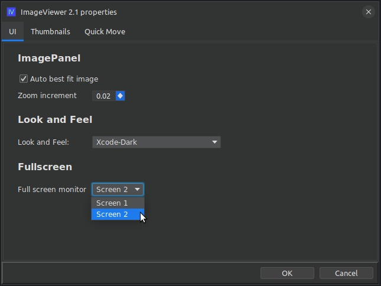

# ext-iv-fullscreen

## What is this?

This is an extension for the imageviewer application that allows you to switch to fullscreen
mode for viewing images. While in fullscreen mode, the usual keyboard shortcuts still work
for navigation. For example, left or up arrow to move to the previous image, right or down arrow
to move to the next image, DEL to delete the current image. 

To exit fullscreen mode, press ESC.

### How do I use it?

Clone the repo and build the extension jar with maven:

```shell
git clone https://github.com/scorbo2/ext-iv-fullscreen.git
cd ext-iv-fullscreen
mvn package
```

Now you can copy the extension jar to wherever you keep your imageviewer extensions:

```shell
cp target/ext-iv-fullscreen-2.2.2.jar ~/.ImageViewer/extensions
```

Now restart imageviewer and you should find a new property in the properties dialog:



In this example, we are using a laptop ("Screen 1") with an external monitor ("Screen 2").
You can use the dropdown to select which display should host the fullscreen view.

### Requirements

Imageviewer 2.2 or higher.

### License

Imageviewer and this extension are made available under the MIT license: https://opensource.org/license/mit
