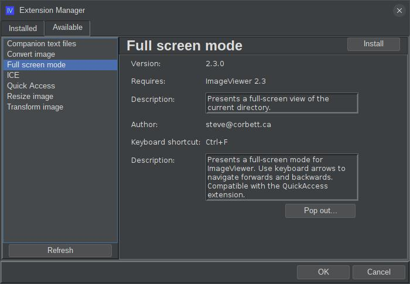
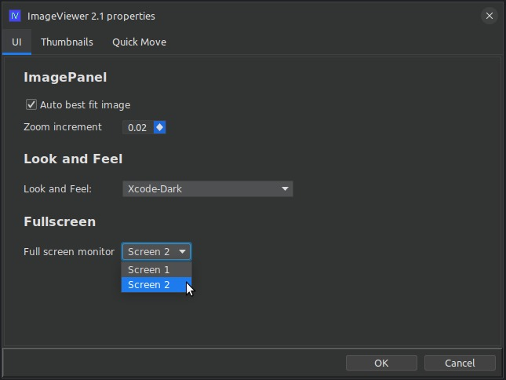

# ext-iv-fullscreen

## What is this?

This is an extension for the [ImageViewer](https://github.com/scorbo2/imageviewer) application that 
allows you to switch to fullscreen mode for viewing images. While in fullscreen mode, the usual 
keyboard shortcuts still work for navigation. For example, left or up arrow to move to the previous image, 
right or down arrow to move to the next image, DEL to delete the current image. 

To exit fullscreen mode, press ESC.

## How do I get it?

### Option 1: automatic download and install

**New!** Starting with ImageViewer 2.3, you no longer need to manually build and install application extensions!
Now, you can use the new and improved extension manager dialog to find and install them automatically:



Go to the "Available" tab and select "Full screen mode" from the list on the left. Then, hit the "install"
button in the top right. If you decide later to remove the extension, come back to the extension manager dialog,
select "Full screen mode" from the list, and hit the "uninstall" button in the top right. The application
will prompt you to restart. It's just that easy!

### Option 2: manual download

You can manually download the extension jar: 
[ext-iv-fullscreen-2.3.0.jar](http://www.corbett.ca/apps/ImageViewer/extensions/2.3/ext-iv-fullscreen-2.3.0.jar)

Save it to your ~/.ImageViewer/extensions directory and restart the application

### Option 3: build from source

You can clone this repo and build the extension jar with Maven (Java 17 or higher required):

```shell
git clone https://github.com/scorbo2/ext-iv-fullscreen.git
cd ext-iv-fullscreen
mvn package

# Copy the result to extensions directory:
cp target/ext-iv-fullscreen-2.3.0.jar ~/.ImageViewer/extensions
```

## Okay, it's installed, now how do I use it?

After restarting ImageViewer, you should find a new property in the properties dialog:



In this example, we are using a laptop ("Screen 1") with an external monitor ("Screen 2").
You can use the dropdown to select which display should host the fullscreen view.
If you are on a system that only has one display, that display will be used automatically.

### Requirements

Imageviewer 2.3 or higher.

### License

Imageviewer and this extension are made available under the MIT license: https://opensource.org/license/mit
